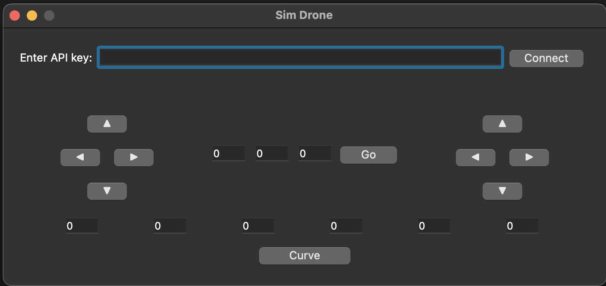

## Getting Started

1. Install PyQt5 using pip:
```bash
python3 -m pip install pyqt5
```

2. Install the drone simulator package
```bash
python3 -m pip install DroneBlocksTelloSimulator
```

3. Run the program using:
```bash
python3 drone_controller.py
```

4. Link to the web simulator
```bash
# Copy the API key and ensure you do not refresh the page. Refreshing the page creates a new API key.
http://coding-sim.droneblocks.io/
```